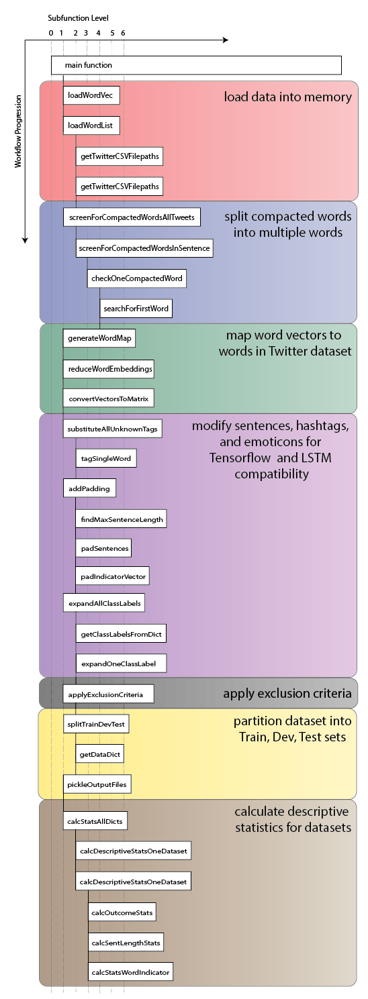

# GreenTweet_MultivariateBiLSTM: Data Preprocessing
text and metadata collection from twitter

 **Dataset** | Train | Test | Dev |NYC | Train | Test | Dev | NYC 
 ------------ | ------------- | ------------- | ------------- | ------------- | ------------- | ------------ | ------------- | ------------ 
**Nature Label** |1|1|1|1|0|0|0|0|
**Sample Size** | 36651 | 2835 | 2937 | 2397 | 26422 | 2165 | 2063 | 2460 
**Label Frequency (%)** |  --------- | --------- | --------- | --------- | --------- | -------- | --------- | -------- 
&nbsp;&nbsp;&nbsp;&nbsp; Safety | 7.77 | 9.38 | 8.07 | 12.22 | 2.50 | 3.19 | 2.62 |8.29 |
&nbsp;&nbsp;&nbsp;&nbsp; Beauty | 6.74 | 7.97 | 7.29 | 6.13 | 1.08 | 1.43 | 1.50 | 1.50 |
&nbsp;&nbsp;&nbsp;&nbsp; Exercise | 10.07 | 10.69 | 1.049 | 6.76 | 0.91 | 0.88 | 0.63 | 0.93 |
&nbsp;&nbsp;&nbsp;&nbsp; Social | 13.40 | 15.66 | 15.73 | 22.11 | 4.52 | 4.85 | 5.14 | 6.46 |
&nbsp;&nbsp;&nbsp;&nbsp; Stress | 1.44 | 1.52 | 1.16 | 1.29 | 0.46 | 0.37 | 0.58 | 0.41 |
&nbsp;&nbsp;&nbsp;&nbsp; Air | 1.12 | 1.06 | 1.40 | 0.25 | 0.27 | 0.37 | 0.15 | 0.16 |
**Emoticon Frequency (%)** | 10.08 | 10.44 | 12.39 | 9.85 | 5.86 | 5.91 | 6.20 | 5.49 |
**Hashtag Frequency (%)** | 23.89 | 24.02 | 24.65 | 29.37 | 18.18 | 19.08 | 17.45 | 26.83 |
**Regional Frequency (%)** | 2.80 | 2.72 | 2.52 | 4.34 | 7.57 | 7.81 | 6.79 | 21.67 |
**Mean Sentence Length (words)** | 18.44 | 18.65 | 18.83 | 18.06 | 19.62 | 19.78 | 19.38 | 19.02 |

**Table 1.  Select Descriptive Statistics from the Train, Test, and Dev Datasets Created from the Data Preprocessing Script, Stratified by Nature Class (1 = positive, 0 = negative)**.      

**Author:** [Andrew Larkin](https://www.linkedin.com/in/andrew-larkin-525ba3b5/)  
**Affiliation:** [Oregon State University, College of Public Health and Human Sciences](https://health.oregonstate.edu/)  
**Date Created:** September 26th, 2018  

**TODO:**  
[ ] add link to POS paper once it's available online  

**Summary**  
Data Preprocessing for the bi-LSTM requires several NLP modifications that weren't required for the [previous Twitter analysis based on Part of Speech tagging](https://github.com/larkinandy/Portland_UrbanNature_Twitter).  Most notably:
- a mapping dictionary needs to be made to transform tweet text into word vectors  
- unknown and padding tags need to be added to sentences  
- sentence length prior to adding padding needs to be determined  
- ompatected words need to be partitioned into multiple words (e.g. #lastchildinthewoods)  
- indicators need to be made to indicate which words in the text belong to hashtags and emoji descriptions  
- inclusion criteria need to be applied to limit bayes optimal error arising from ambiguous text  
- the dataset needs to be partitioned into train, dev, and test sets  
- descriptive statistics need to be run to compare train, dev, and test set compatibility  

The Data Preprocessing section contains the following documents:
- [**Datasets**](./datasets) - Dataset products after preprocessing text.  
- [**DatasetDescriptiveStats.xlsx**](./DatasetDescriptiveStats.xlsx) - Table with descriptive statistics for train, test, and dev datasets
- [**PreprocessTweets.ipynb**](./PreprocessTweets.ipynb) - Jupyter notebook containing python script for performing all of the operations described above  
- [**AddRegionalContextIndicator.ipynb**](./AddRegionalContextIndicator.ipynb) - Jupyter notebook for adding the regional contet flag - indicates whether a word within the tweet text corresponds to a keyphrase that has unique context within the originating region  
- **Readme.md** - this file, documenting the precprocess workflow and results

**External Links**  
**Stanford Word Vectors** - https://nlp.stanford.edu/projects/glove/  

### Workflow ###

Workflow for the PreprocessTweets is shown below in Figure 1.  Workflow for the AddRegionalContextIndicator notebook is shown below in Figure 2. 

  

**Figure 1.  Workflow for the PreprocessTweets notebook**  

  
**Figure 2.  Workflow for the AddREgionaContextIndicator notebook**  
