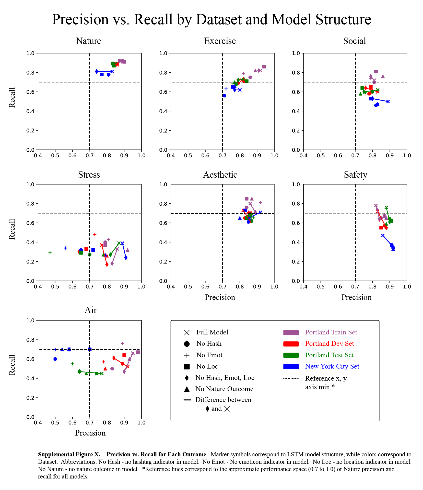
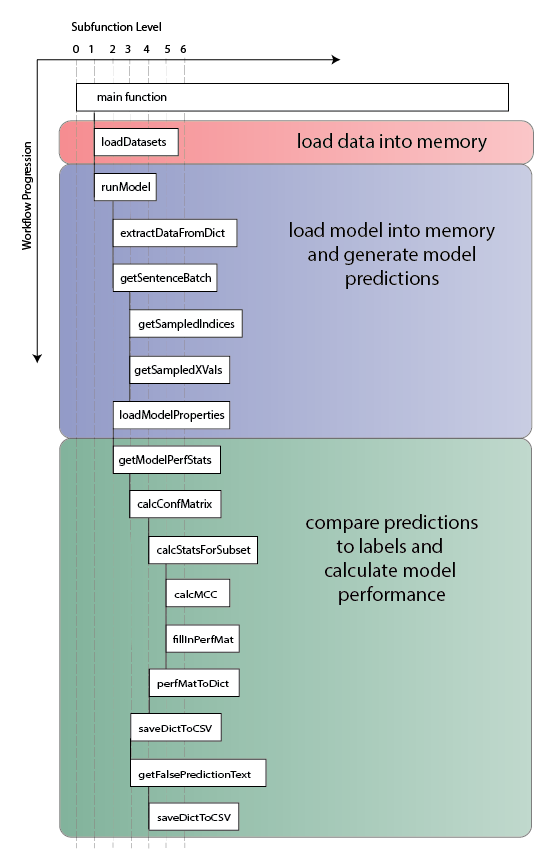
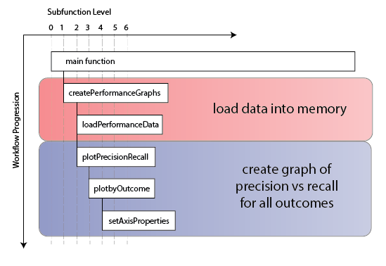

# GreenTweet_MultivariateBiLSTM: Model Evaluation
text and metadata collection from twitter

**Author:** [Andrew Larkin](https://www.linkedin.com/in/andrew-larkin-525ba3b5/)  
**Affiliation:** [Oregon State University, College of Public Health and Human Sciences](https://health.oregonstate.edu/)  
**Date Created:** September 26th, 2018  

### Summary ###
Model performance was evaluated using 5 performance measures across four datasets and six variations of the model structure.  

**Performance statistics**
1) [F1Score](https://en.wikipedia.org/wiki/F1_score)
2) [Mathews Correlation Coefficient](https://en.wikipedia.org/wiki/Matthews_correlation_coefficient) 
3) [Precision and Recall](https://en.wikipedia.org/wiki/Precision_and_recall)
5) [Confusion Matrix](https://en.wikipedia.org/wiki/Confusion_matrix)

**Datasets**  

1) Training dataset, tweets from Portland, Oregon (n=64000)
2) Dev dataset, tweets from Portland, Oregon (n=5000)
3) Test dataset, tweets from Portland, Oregon (n=5000)
4) Generalization dataset, tweets from New York City, New York (n=4850)

**Models**  
1) Full Model - contains input word vectors, hashtag indicators, emoticon indicators, and location indicators.  Predict all 7 outcomes  
2) No Hash - same as the full model but without the hashtag indicators  
3) No Emot - same as the full model but without the emoticon indicators  
4) No Loc - same as the full model but without the location indicators  
5) No hash, emot, or loc - same as the full model but without the location, hashtag, or emoticon indicators  
6) No nature - same as the full model but predicting 6 rather than 7 outcomes (not predicting nature label)  

### Files ### 

[**ModelPerformanceTables_Jan6_18.xlsx**](./ModelPerformanceTables_Jan6_18.xlsx) - Performance statistics for all 24 dataset-model combinations  
[**ModelPrecisionRecall_Jan6_18.csv**](./ModelPrecisionRecall_Jan6_18.csv) - Precision and Recall metrics, reformatted for creating  the Precision vs. Recall diagram using the ModelValidationGraph script  
[**ModelEvaluationGraphs**](./ModelEvaluationGraphs.ipynb) - Jupyter notebook to load multiple trained tensorflow models on multiple datasets, and claculate perofrmance metrics 
**Readme.md** - this file.  Overview of the Model Validation folder

### Workflow ###

Model evaluation workflow is partitioned into two steps: 

1) **Evaluate model predictions with multiple datasets**  
Workflow  for evaluating model predictions is shown below.  The workflow starts by loading datasets into memory (functions highlighted in red).  Next, the tensorflow model is loaded into memory, and model predictions are generated for test datasets, in batches if the dataset is too large to process all at once (functions highlighted inblue). Finally, model performance statistics including F1 Score, MCC, and confusions matrices are calcualted, and text of misclassified records are written to secondary storage (functions highlighted in green).  This process is repeated for multiple models and multiple datasets  

2) **Graph precision and recall for all outcomes**  
Workflow for creating  precision vs. recall graphs are shown below.  The workflow starts by loading precision and recall values from storage into memory (functions highlighted in red).  Next, matplotlib creates subset plots for each outcome, including by setting custom properties for axes and reference labels in each subplot. The final graph has unique colors for each input dataset, and unique markers for each tested model  

