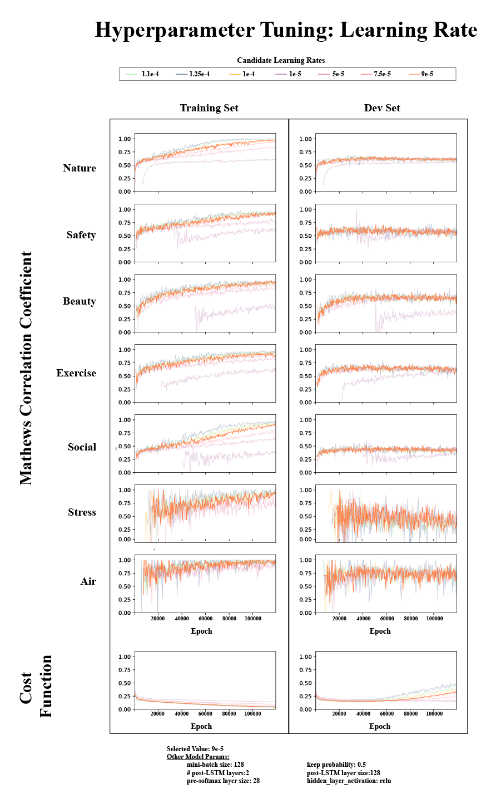
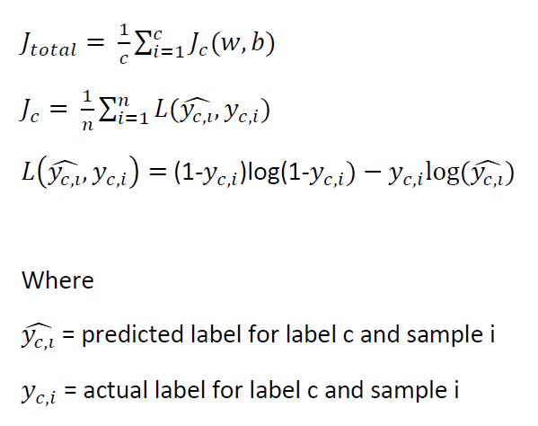
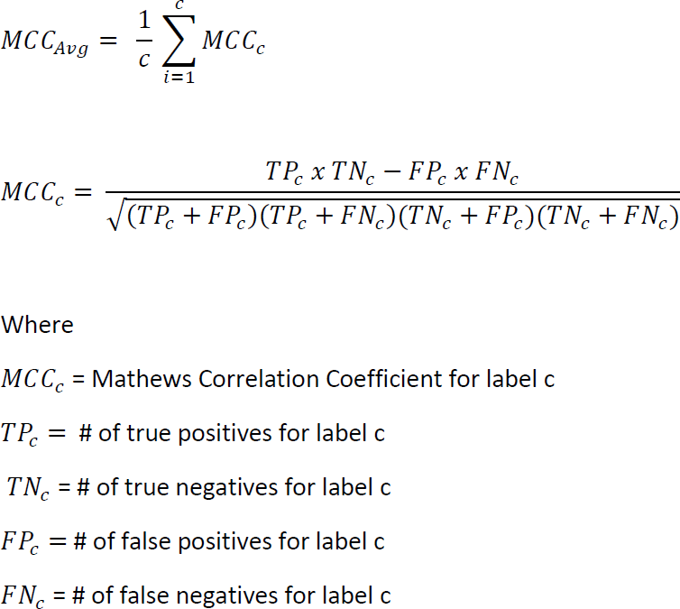

# GreenTweet_MultivariateBiLSTM: Model Training and Testing : Hyperparameter Tuning
text and metadata collection from twitter

 
**Figure X. Model performance while varying the learning rate parameter**

**Author:** [Andrew Larkin](http://www.linkedin.com/in/andrew-larkin-525ba3b5/)  
**Affiliation:** [Oregon State University, College of Public Health and Human Sciences](http://health.oregonstate.edu/)  
**Date Created:** October 15th, 2018  

### Summary ###
Hyperparameter tuning methodology and results are described here.  This secction if comprised of the following documents:

**Readme.md** - describes the tuning methodology, including hyperparameters to tune, range of hyperparameter values, evaluation metrics, and selection strategy  
[**HParramTuning.ipynb**](./HParamTuning.ipynb) - Notebook with tensorflow code to tune hyperparams and records results  
[**TrainingPerfGraphs.ipynb**](./TrainingPerfGraphs.ipynb) - Notebook for calculating summary statistics and creating multiplot graphs for each parameter to tune  
[HParamGraphs](./HParamGraphs) - Graphs comparing model performance under varying values of select hyperparameter  

**Note:** The material here is supplementary rather than superlative of published methods and results (insert link once published).  Please see the published materials for a comprehensive description of the model training and testing process.

### Model hyperparameters ###
Model hyperparameters are shown below in Table 1.  For tunable hyperparameters, the set of candidate parameter values are listed as well.  Tuning the learning rate or "alpha" hyperparameter consisted of two stages, where the first stage consisted of a "coarse search" along 0.01 unit changes in alpha, followed by a more fine search of 0.001 units between the best performing subset alpha candidate values.

Symbol | Description | Tuning? | Test Value Set | 
------------ | ------------- | ------------- | ------------- 
α | learning rate | Yes | {1.1e-4, 1.25e-4 1e-4, 1e-4, 1e-5, 5e-5, 7.5e-5, **9e-5**}* |
τ |  # hidden post-LSTM layers** | Yes | {1,**2**,3} |
ι | # hidden nodes per post-LSTM layers** | Yes | {32, 64, 128, **256**} | 
h | # hidden nodes in pre-sigmoid layer | Yes | {**14**, 28, 56 } |
m | minibatch size | Yes | {**64**, 128, 256, 512} | 
λ1 | dropout rate LSTM | Yes | {0, **0.1**, 0.25, 0.5, 0.75, 0.9}* |
λ2 | dropout rate post-LSTM | Yes | {0.1, **0.5**, 0.9 } |
g | activation function*** | Yes | {**tanh**, relu, leaky relu } |
c | # outcomes | Yes | {5,6,**7**} |
e | # epochs | No | {120000} |
β1 | momentum term of ADAM optimizer | No | 0.9 |
β2 | RMSProp term of ADAM optimizer | No | 0.999 |
ε | small constant of ADAM optimizer | No |1e-8 |
v | # biLSTMs | No | # words in longest Tweet + 1 |

**Table 1.** Hyperparameters in biLSTM model. * Parameters are part of a coarse-to-fine search strategy.  Only coarse search parameters are shown. ** Not including / not applicable to the bidirectional LSTM units. *** For hidden units only. Sigmoid is the activation function for all output units.  Selected parameters are highlighted in bold 

### Evaluation Metrics ###
Two evaluation metrics were used to tune hyperparameters:
1) **Cost function J** - the unweighted arithmetic mean cost function for all c outcomes in a given candidate model

  
 
 

2) **Mathews Correlation Coefficient** - Correlation between label and predictions.  Values range from -1 (prediction is exact opposite of label) to 1 (prediction perfectly matches label), and a value of 0 is equivalent to random guessing.

  
 
 

### HParramTuning Pseudocode ###
Workflow of the script HParramTuning.ipynb is as follows:

1. Load train and dev sets into memory
2. Define the model structure  
  a. Create embeddings  
  b. Create LSTMS  
  c. Create post-LSTM hidden layers  
  d. Create pre-softmax hidden layer  
  e. Create softmax layer  
  f. Define cost function  
3. Run training model  
  a. Create session  
  b. For each epoch 
    1. Perform forward and backward propagation  
    2. If epoch % 500 = 0:  
      a. calculate TP, FP, TN, and FN  
      b. calculate precision, recall, F1 Score, cost, and MCC  
4. Save model predictions and matching labels to disk  

### TrainingPerfGraphs Workflow ###

Workflow of the Training Performance Graph notebooks is shown below.  Workflow can be divided into 3 sections:
1. Load model predictions and matching labels from disk  
2. For each candidate value, calculate summary statistics for train and dev sets 
3. Graph summary statistics for train and dev sets and save to disk  

### External Links ###
**https://en.wikipedia.org/wiki/Loss_function**  
**https://en.wikipedia.org/wiki/Matthews_correlation_coefficient**
