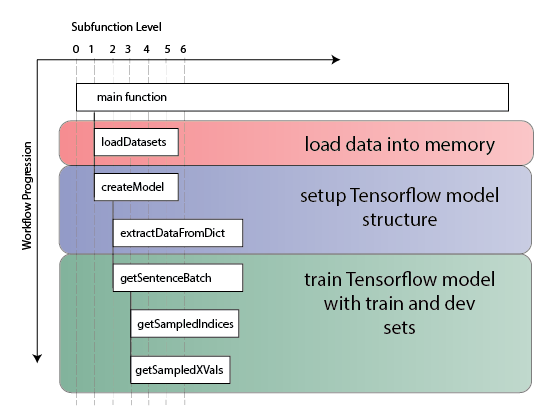

# GreenTweet_MultivariateBiLSTM: Model Training
text and metadata collection from twitter

**Author:** [Andrew Larkin](https://www.linkedin.com/in/andrew-larkin-525ba3b5/)  
**Affiliation:** [Oregon State University, College of Public Health and Human Sciences](https://health.oregonstate.edu/)  
**Date Created:** September 26th, 2018  

**Summary**  This folder contains the scripts for training models once hyperparameters are fixed.  

### Files ###

[**ModelTraining_FixedParams.ipynb**](./ModelTraining_FixedParams.ipynb) - notebook for training and saving models with the chosen hyperparamters.   
[**GT_Model**](./GT_Model) - metadata and weights of final model, saved as tensorflow objects.  **NOTE:** this folder won't be available until the corresponding manuscript is published  
**Reamde.md** - this document, providing an overview of the Model Training process once hyperparameters are fixed

### Workflow ###

Workflow for model training with fixed parameters is shown below.  The pipline involves three stages
1) Load train and dev datasets into memory
2) Define the tensorflow model structure and set hyperparameter values
3) Train the tensorflow model using the train set, and save model with best performance on the dev set

**Note:** The material here is supplementary rather than superlative of published methods and results (insert link once published).  Please see the published materials for a comprehensive description of the model training and testing process.

