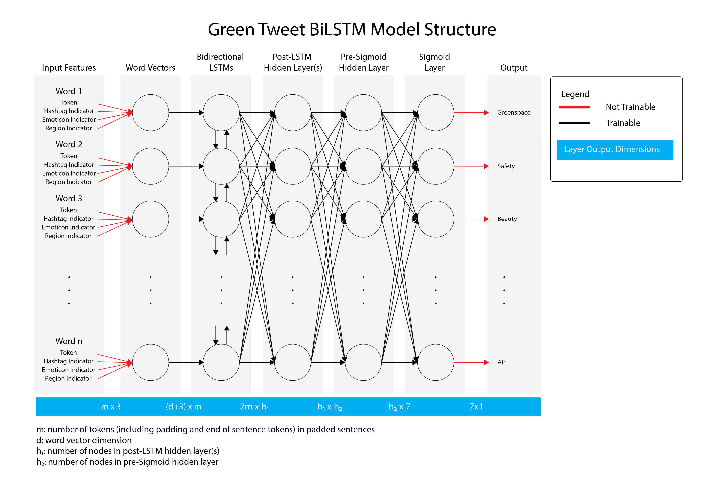

# GreenTweet_MultivariateBiLSTM: Model Training
text and metadata collection from twitter

**Author:** [Andrew Larkin](https://www.linkedin.com/in/andrew-larkin-525ba3b5/)  
**Affiliation:** [Oregon State University, College of Public Health and Human Sciences](https://health.oregonstate.edu/)  
**Date Created:** September 26th, 2018  

**Summary**  This section describes the model training and testing stategy, along with supplementary results not included in manuscdript publications.  The Model Training and Testing section contains the following documents/subsections:

[**Hyperparameter Tuning**](./HyperparameterTuning) - Folder with the hyperparamter tuning process and corresponding results  
[**Fixed Param Training**](./FixedParamTraining) - Creating the final models once hyperparameters are fixed.  **NOTE:** this folder will include the final model metadata and weights once the corresponding manuscript is published   
**Reamde.md** - this document, providing an overview of the Model Training and Testing section of the GreenTweet_MultivariateBiLSTM github repository

**Note:** The material here is supplementary rather than superlative of published methods and results (insert link once published).  Please see the published materials for a comprehensive description of the model training and testing process.

